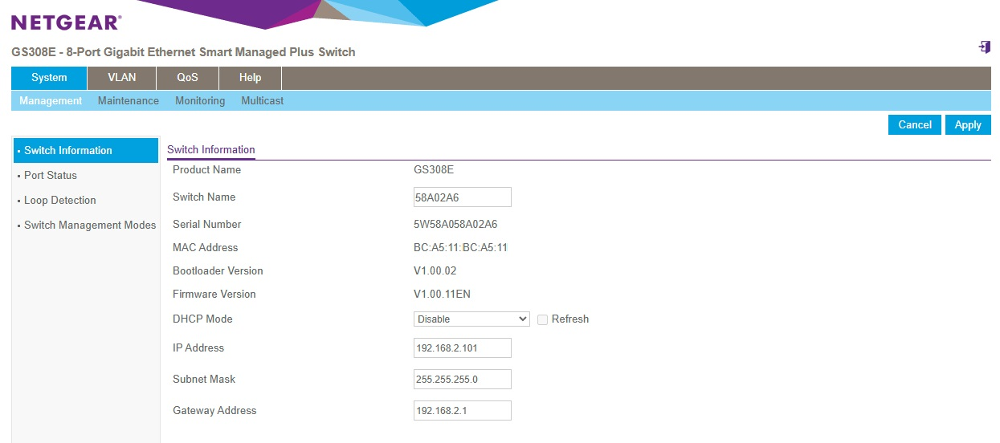

# Netgear Switch Admin Tool

A Python utility for managing Netgear Plus managed switches via command line. It connects via their web interface and makes changes and allows you to switch ports on/off, read port status and reboot the switch strait out of your command line or automation service.

## Supported Devices

- Most [Netgear Plus]( https://www.netgear.com/ca-en/business/wired/switches/plus/) switches with a web interface like this one; 

 

### Tested and updated on the following models

- GS308E (using numeric hash format)
- GS108PEv3 (using alphanumeric/MD5 hash format)

### Supporting additional models

Please feel free to submit a bug request to support additional models. Note that if any of the following are showing 0 then there is a change to the web page format and I will need to find a way to extract the right values from your page.

Please also capture the cookie and hash formats with a web browser - Press F12 in your browser and go to the web console to capture the calls;

- For "DEBUG: Extracted cookie: 0" -> Value "Cookie" In the header of each request - starts with "GS108SID=..." for this line of switches but could be different 
- For "DEBUG: Found hash value: 0" => Inspect the HTML request of device_reboot.cgi 

## Features

- Toggle switch ports on/off
- Read port status
- Reboot switch

## Usage

```
# Turn OFF port 4
python netgear_admin.py -a 192.168.0.163 -passwd <password> -p 4 -s off

# Turn ON port 4
python netgear_admin.py -a 192.168.0.163 -passwd <password> -p 4 -s on

# Read status of ports
python netgear_admin.py -a 192.168.0.163 -passwd <password> -r

# Reboot the device
python netgear_admin.py -a 192.168.0.163 -passwd <password> -reboot
```

## Requirements

- Python 3.x
- Standard libraries (no external dependencies)

## Known Issues

- Only one port can be toggled per run
- The switch may return 'The maximum number of attempts has been reached' errors. In this case wait a few mintues before retrying
